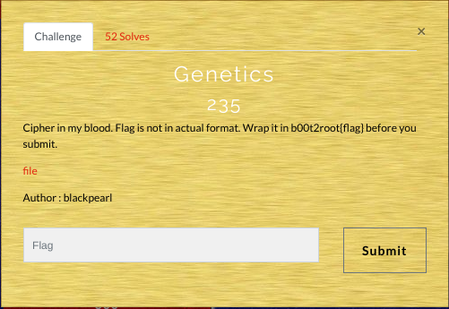

# GENETICS

##Difficulty level: Easy(:P)

##Writeup:
  The name Genetics itself suggests it has to do something with Biology!!ATCG reminds us of DNA base pairs.
  The encoded string given was:
  
  > ACCAGTAAAACGTTGAGACAGTTGAATATCAAACTACACCGAATTCATATGTCACAGCGGCCGACACAGATGATAACA
  
  After a lot of googling I found a github repo (https://github.com/JohnHammond/ctf-katana) which speaks of online mapping of
  DNA codes.And then manually decoding the given string yielded "flag is dna crypto1sAwesome" and VIOLA we get our flag.
  
  
  
  > b00t2root{dnacrypto1sAwesome}
  
  
  
